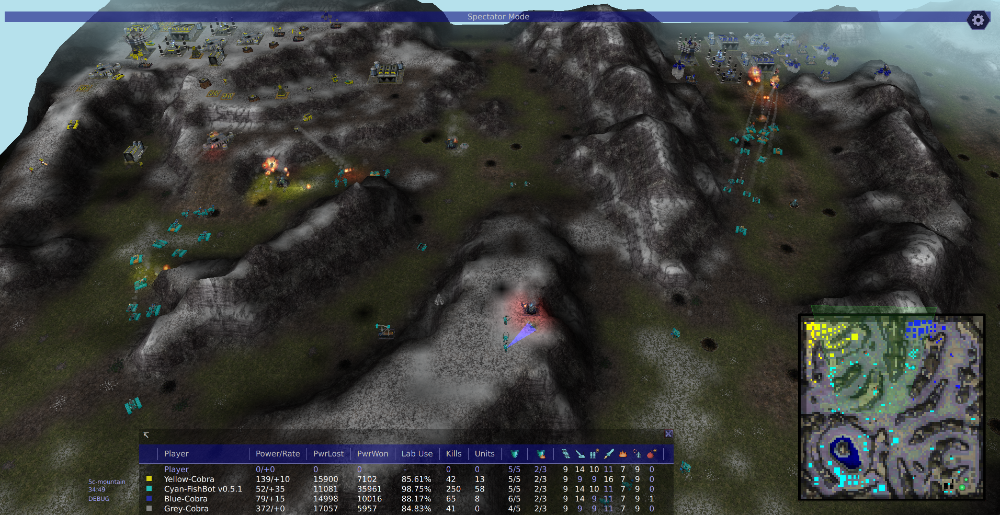

# FishBot, a capable T2 Warzone 2100 bot 

FishBot is a Warzone 2100 AI bot compatible with Warzone 2100 **v4.6.1+**.

It is designed for Tech Level 2 (No Scavenger) skirmish games on the supported maps below. Starts at other tech levels are currently not supported.

*Figure 1: FishBot **v0.5.1** using two unit groups to attack two bases simultaneously.*

## Download

1. Open Warzone 2100. Click on "Options".
2. Click "Open Configuration Directory" in the bottom left corner.
3. Download 📦fishbot.zip from https://github.com/fishbotdev/fishbot/releases. 
4. Move the .zip file to 📁`mods/4.7.0/autoload/`. **To avoid any version conflicts, please remove all old versions of FishBot (v0.5.0 and below)**.
5. Restart Warzone 2100.

To check if the path is correct, you should be able to find `FishBot.js` in this location:

**`%MY_WARZONE2100_CONFIG_DIRECTORY_PATH% \ mods \ 4.7.0 \ autoload \ fishbot \ multiplay \ skirmish \ FishBot.js`**

If you can find `Fishbot.js` here, FishBot should automatically load on the next startup of Warzone 2100. It will then be available to select as an AI bot.

## Supported technology levels
Currently, only T2 (**Technology Level 2**) starts are supported. Further support for other technology levels might be added in a future version. 

## Supported maps (Warzone2100 4.7.0)
As of **v0.5.2**, FishBot works on most "low-oil" maps shipped with the game.

FishBot is currently not compatible with scavengers; it currently ignores them.

### 2 player (T2-NoScav)
* `Sk-Startup` (100% duel)
* `Sk-UrbanChasm` (100%)
* `Sk-HighGround` (90% duel)
* `Roughness` (100% duel) 
* `Vision` (90% duel)
* `DustyMaze (2P)` (*tested manually*)

### 3 player (T2-NoScav)
* `Monocot` (100% duel, 100% FFA)
* `Gamma` (100% duel, 73% FFA)

### 4 player (T2-NoScav)
* `Sk-Rush` (100% duel, 68% FFA)
* `Sk-Rush2` (98% duel, 80% FFA)
* `Sk-UrbanDuel` (98% duel, 98% FFA)
* `Sk-Mountain` (97% duel, 72% FFA)
* `Sk-Valley` (98% duel, 80% FFA)
* `Sk-FishNets` (88% duel, **22% FFA**) -- does not handle narrow water obstacles well
* `Sk-GreatRift` (98% duel, 68% FFA)
* `Sk-RollingHills` (91% duel, 90% FFA) 
* `Sk-Basingstoke` (89% duel, 79% FFA)      
* `Sk-LittleEgypt` (95% duel, 54% FFA)      
* `Sk-Cockpit` - (100% duel, 77% FFA) 
* `Sk-Urban-Chaos` (95% duel, 88% FFA)
* `Sk-Pyramidal` (100% duel, 72% FFA)
* `DustyMaze-2v2` (*tested manually*)
* `DustyMaze-FFA` (*tested manually*)

### 5 player (T2-NoScav)
* `Bloat` (64% FFA)

### 6 player (T2-NoScav)
* `Melting` (55% FFA)
* `Entropy` (*tested manually*)

### 7 player (T2-NoScav)
* `Thales` (*tested manually*)

### 8 player (T2-NoScav)
* `Sk-Clover` (45% FFA) 
* `Sk-MizaMaze` (38% FFA)
* ~~`Sk-Manhattan`~~ - **not compatible**: central river blocks land units
* `Sk-Bananas` (39% FFA)
* `Sk-Wheel` (44% FFA)
* `Sk-Ziggurat` (29% FFA)
* `Sk-Concrete` (37% FFA)
* `Sk-ThePit` (46% FFA)
* `Sk-HideNSneak` (39% FFA)
* `Sk-YinYang` (59% FFA)
* `Sk-SandCastles` (55% FFA)
* `Sk-BeggarsKanyon` (56% FFA)
* `Sk-Gridlock` (40% FFA)
* `Sk-Cockate` (45% FFA)

### 9 player (T2-NoScav)
* `Sk-WindFury` (*tested manually*)

### 10 player (T2-NoScav)
* `Emergence` (*tested manually*)
* ~~`WaterLoop`~~ - **not compatible**: sea map

### Test methodology
For a map to be compatible, FishBot must have an absence of breaking issues, and ideally:
* Greater than 1/N win rate in N-player FFA (cumulative across all positions) against Cobra @ Medium difficulty, and
* Greater than 75% win rate in duels across all pairs of positions against Cobra @ Medium difficulty (i.e. 1v1 with all other player slots being spectators).

## Recent updates
* **v0.5.3** - *released **xx Sep 2026***
    * Combat fixes:
        * Improved group cohesion during heavy fighting.
        * Improved VTOL utilisation when the match is neck-and-neck.
        * Unit designs tweaked.
    * Improved the construction planner to reduce trucks oscillating back and forth doing nothing.
    * Excluding 10-player maps and sea maps, all other Warzone 2100 maps are now covered by automated E2E testing.

* **v0.5.2** - *released **01 Sep 2026***
    * Combat improvements, including a complete overhaul of group movement and targeting. 
        * This should result in smoother and seemingly more intentional group behaviour, with better handling of chokepoints.
    * Performance improvements, resulting in a smoother player experience on all base maps shipped with the game.
    * Fixed some long-standing construction issues related to oil capture.

* **v0.5.1** - *released **04 Aug 2026***
    * Now supports custom structure limits in skirmish settings.
    * Fixed other construction issues e.g. trying to build behind destroyable features, and trucks ignoring (some) dangerous situations.
    * Improved research transition from T2 to T3 (Cannon path). FishBot will now unlock Tiger / Vengeance bodies and Rail Gun / Gauss Cannon earlier.

* **v0.5.0** - *released **29 Jul 2026***
    * Now compatible with most maps shipped with Warzone 2100 v4.7.0 (validated by a new automatic testing pipeline).
    * Greatly improved combat effectiveness; now up to 4 combat groups are used.
    * Major overhaul of the production, resupply & repair systems to support the above.
    * Improved base construction efficiency & added build order adaptation for very low-oil maps.

Please see [`CHANGELOG.md`](CHANGELOG.md) for a detailed list of all past changes.

## Upcoming features
The current areas for improvement are:
* Strategic improvements (FishBot's current strategic level is: 'this is the closest target, go there').
* Tactical-level targeting improvements (i.e. preventing target oscillation).
* Support for T1 & T3.

## Disclaimer: Use of AI
Prior to **v0.5.2**, ChatGPT was used sparsely to implement some of the math functions, but the majority of the logic and architecture was human-authored.

From **v0.5.2** onwards, Claude Code has been actively used to make improvements to the bot, primarily using the Opus & Sonnet models. The work is still human-directed and reviewed though. 

## Background and Goals
FishBot was initially forked from NullBot v3. I acknowledge and appreciate the work of the NullBot team in creating the foundation for this body of work. As of v0.4.0, not much of the original code remains, but I am grateful for the structural and spiritual influence of the original work.

I played Warzone 2100 many years ago, and I remember how much happiness it brought me as as a kid. 
It was so much fun to build up a little army, rush the AI and see the enemy base satisfyingly turn into little puffs of debris.
I am hoping that FishBot will bring a little bit of that happiness to our dedicated players by being a fun, fresh and challenging opponent (or ally) for your skirmish games.

My goal is to make FishBot a generally useful bot which could be packaged with the official game one day. 
As mentioned above, I'd like it to be genuinely fun to play with, both as a teammate and as an opponent! 
Admittedly, there is a long way to go - but I am hoping that one day I am able to make this wish come true. 

## Documentation

* For a high-level view of the FishBot software system, please see `docs\ARCHITECTURE.md`.
* To get set up with development, please see `docs\DEVELOPMENT.md`.
* For a detailed list of changes from version to version, please see `CHANGELOG.md`.

## Licensing Information (GPL 2.0)

This file is part of FishBot, a Warzone 2100 AI.

FishBot is free software; you can redistribute it and/or modify it under the terms of the GNU General Public License 
as published by the Free Software Foundation; either version 2 of the License, or (at your option) any later version.

FishBot is distributed in the hope that it will be useful, but WITHOUT ANY WARRANTY; without even the implied 
warranty of MERCHANTABILITY or FITNESS FOR A PARTICULAR PURPOSE. See the GNU General Public License for more details.

You should have received a copy of the GNU General Public License along with this program. 
If not, see <https://www.gnu.org/licenses/>.