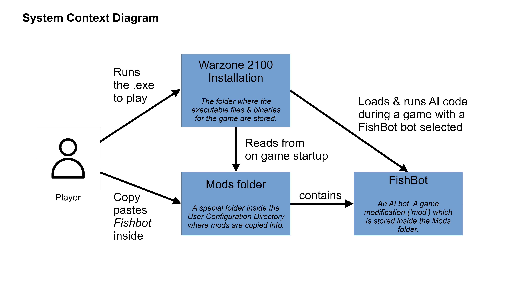
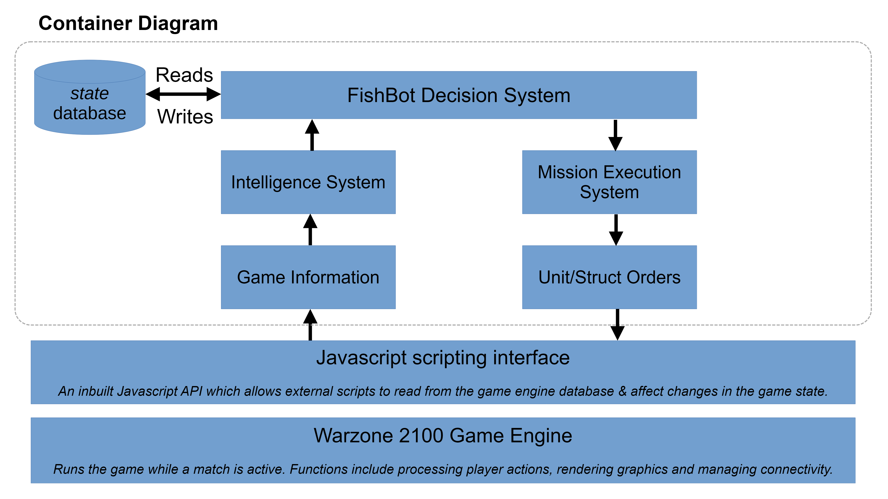
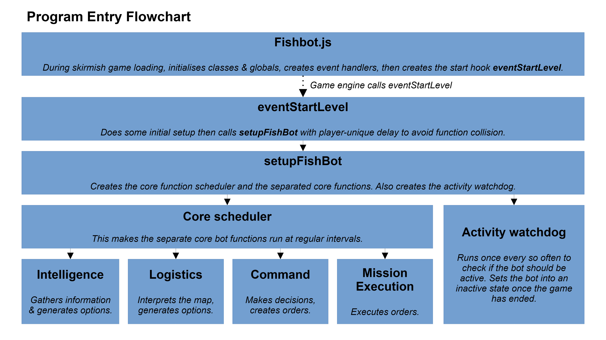
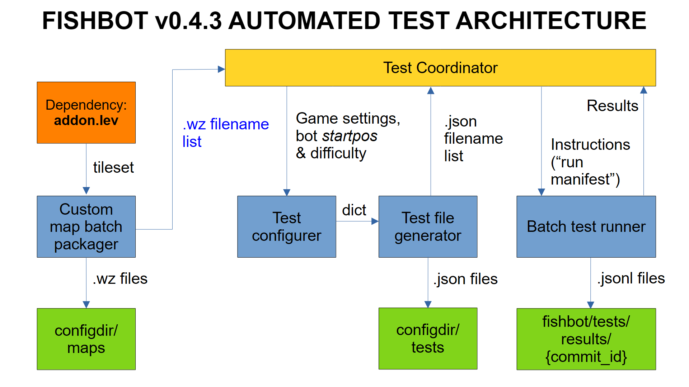

# FishBot Software Architecture
These diagrams are recent as of `FishBot v0.4.3+`.
They show how FishBot interacts with its partner systems.

## System Context Diagram

Figure 1: This diagram shows how the user would interact with FishBot.

## Container Diagram

Figure 2: This diagram shows how the Warzone 2100 Game Engine interacts with FishBot.

## Program Entry Flowchart

Figure 3: This diagram shows the normal entry path for the bot code to begin executing.

## Automatic Testing Pipeline
FishBot is automatically tested in two modes:
1. Duel mode (vs 1 Cobra player, where all other slots are Spectator bots) for all 2p, 3p and 4p maps shipped with the game.
2. FFA mode (vs N-1 other Cobra players) for 3p and 4p maps shipped with the game.

These tests are implemented using the test pipeline below:

Figure 4: FishBot v0.4.3+ automated testing pipeline.
 